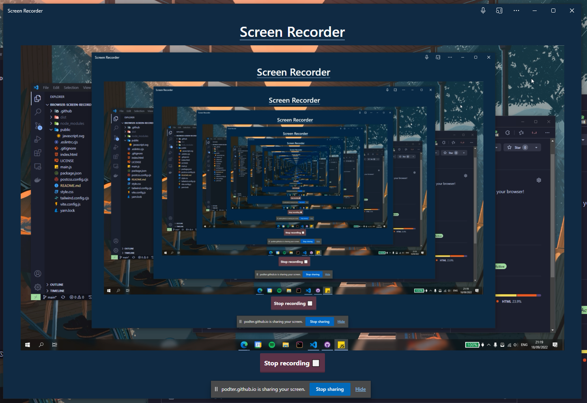

# browser-screen-recorder

Screen recorder on your browser and installable as PWA

https://podter.github.io/browser-screen-recorder/



## Development

Make sure you have Node.js installed (LTS is recommended)

Install dependencies

```bash
npm install
# or yarn
yarn
```

Start development server

```bash
npm run dev
# or yarn
yarn dev
```

## Building

Build to `dist`

```bash
npm run build
# or yarn
yarn build
```

Serve the built app

```bash
npm run preview
# or yarn
yarn preview
```
